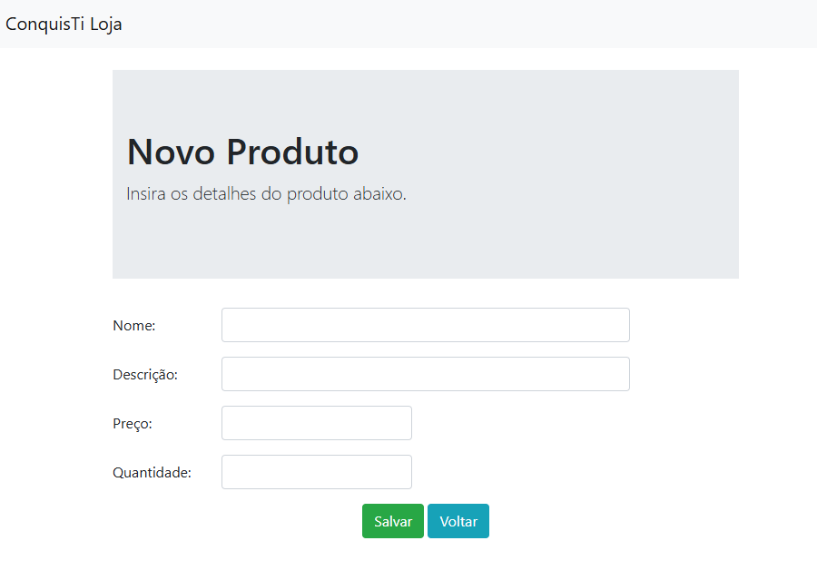

# CRUD de Produtos com Go

Um projeto simples de CRUD (Create, Read, Update, Delete) desenvolvido em Go, utilizando arquitetura MVC, banco de dados PostgreSQL e templates HTML para gerenciamento de produtos.

## Interface

<div align="center">
  
</div>

## Sumário

- [Tecnologias Utilizadas](#tecnologias-utilizadas)
- [Status](#status)
- [Descrição](#descrição)
- [Funcionalidades](#funcionalidades)
- [Como Usar](#como-usar)
- [Autor](#autor)

## Tecnologias Utilizadas

<div style="display: flex; flex-direction: row;">
  <div style="margin-right: 20px; display: flex; justify-content: flex-start;">
    
  </div>
  <div style="margin-right: 20px; display: flex; justify-content: flex-start;">
    
  </div>
  <div style="margin-right: 20px; display: flex; justify-content: flex-start;">
    
  </div>
</div>

## Status


## Descrição

Este projeto é uma aplicação web para gerenciar produtos em um banco de dados. Ele inclui funcionalidades para criar, visualizar, editar e excluir produtos, utilizando a linguagem Go com PostgreSQL como banco de dados e templates HTML para interface do usuário.

## Funcionalidades

- Listar todos os produtos cadastrados.
- Adicionar novos produtos.
- Editar informações de produtos existentes.
- Remover produtos do banco de dados.
- Interface web simples e funcional.

## Como Usar

1. **Configurar o banco de dados**:

   - Certifique-se de ter o PostgreSQL instalado e rodando.
   - Crie o banco de dados `go_crud`:
     ```sql
     CREATE DATABASE go_crud;
     ```
   - Crie a tabela `produtos`:
     ```sql
     CREATE TABLE produtos (
         id SERIAL PRIMARY KEY,
         nome VARCHAR(100),
         descricao TEXT,
         preco NUMERIC(10, 2),
         quantidade INT
     );
     ```

2. **Configurar o arquivo `db.go`**:

   - No arquivo `db/db.go`, atualize as credenciais de conexão:
     ```go
     conexao := "user=SEU_USUARIO dbname=go_crud password=SUA_SENHA host=localhost sslmode=disable"
     ```

3. **Iniciar a aplicação**:

   - Execute o comando:
     ```bash
     go run main.go
     ```

4. **Acessar no navegador**:
   - Abra o navegador e acesse: [http://localhost:8000](http://localhost:8000).

## Autor

Desenvolvido por Diego Franco.
